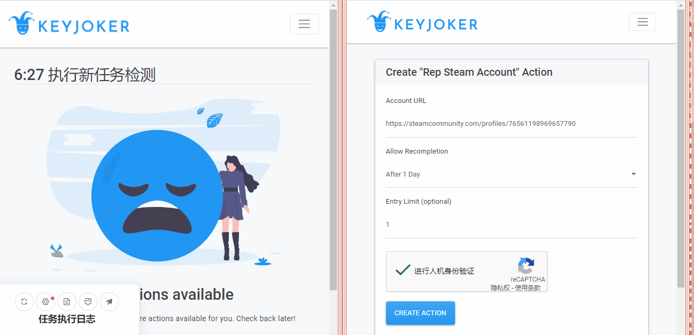
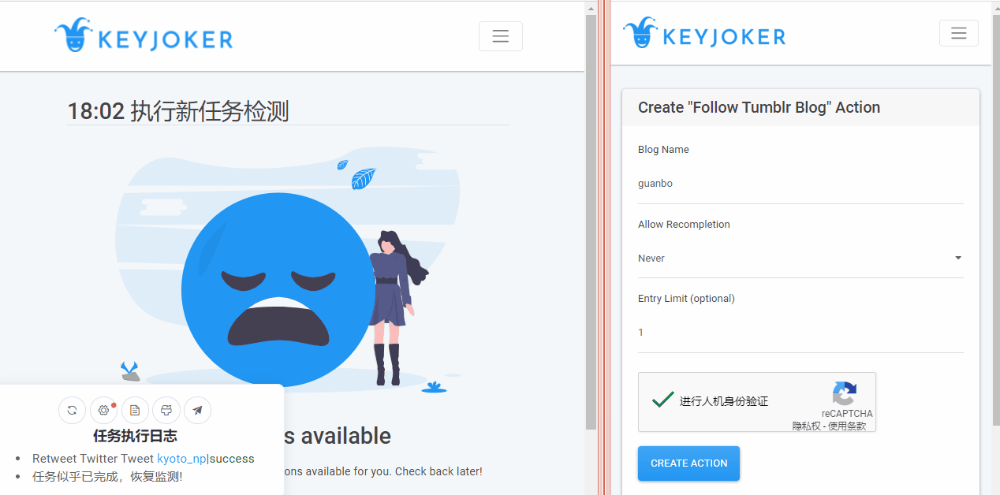
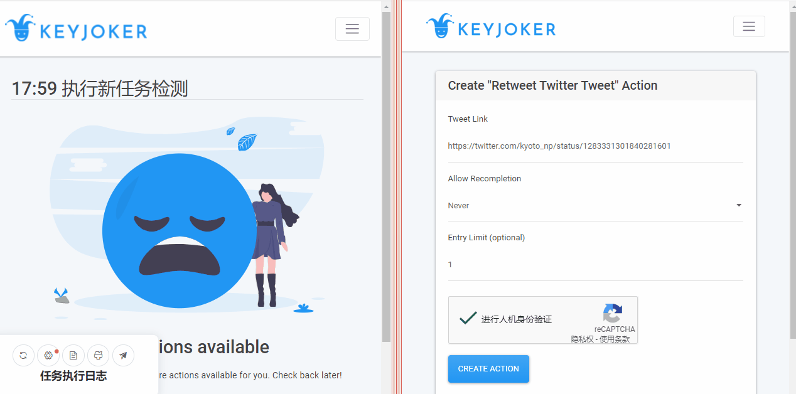

# KeyJoker自动任务脚本
 TMScript for KeyJoker.
 
在Chrome&Edge(new)浏览器+tampermonkey插件正常运行，没有测试其他的！

脚本是依据自定义响应头编写的，可能会有BUG，欢迎前来反馈

# 功能支持状态
[ ✔支持 |⭕支持中 |❌不支持 ]
|功能|登录状态检测|凭证更新|自动做任务|提交任务|
|----|----------|--------|---------|-------|
|Join Steam Group|⭕|✔|✔|✔|
|Rep Steam Account|⭕|✔|✔|✔|
|Wishlist Steam Game|⭕|✔|✔|✔|
|Retweet Twitter Tweet|⭕|✔|✔|✔|
|Follow Twitter Account|⭕|✔|✔|✔|
|Follow Twitch Channel|✔|✔|✔|✔|
|Join Discord Server|✔|✔|✔|✔|
|Save Spotify Album|✔|✔|✔|✔|
|Follow Tumblr Blog|✔|✔|✔|✔|
|Follow Spotify Account|✔|✔|✔|✔|
|Get hCaptcha Access Cookie|✔|✔|✔|❌|

# 安装
1. 脚本基于TamperMonkey,没有的先装上：http://tampermonkey.net/

2. 安装脚本：[GitHub](https://github.com/jiyeme/keyjokerScript/raw/master/keyjoker.user.js) | [GreasyFork](https://greasyfork.org/zh-CN/scripts/406476)（更新有延迟）

# 食用
1. 点击设置时间间隔

2. 点击“开始检测”（点击之后选项会变成“停止检测”）

3. 出现确认框，点击确定

4. 出现如下情形即可

# 部分功能说明
1. 极速/稳定模式：在检测到新任务后，需要加载js重载列表，稳定模式加载官方线上js，极速模式加载嵌套在脚本中的js（版本非最新，但省去网络请求时间、速度快）

# 演示

